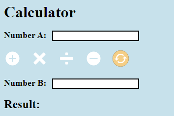
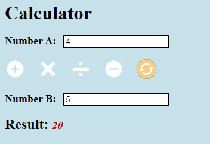

# SimpleCalculator-using-ASP.NET
This is a simple lab exercise of my university, which I code in order to get acquainted with web services                                                                            
Utilization of a calculator service located on the web: http://www.dneonline.com/calculator.asmx

# Indicative Screens

# How to test it in your pc
First download the repository .zip file and save it in your pc!  
Then unzip the .zip file and move it to the folder ..\Documents\Visual Studio 2015\WebSites  
Now open Visual Studio 2015 and go to File -> Open -> WebSite.. -> Select the folder "SimpleCalculator-using-ASP.NET-master" and click "Open"  
Click now to the button "Save All" and directly after click again the "Save" button without modifying the default Path that will appear  
Now, go to Build -> Rebuild solution and then you are ready to run in your browser the "Default.aspx" by clicking the green arrow(button) at the top!

